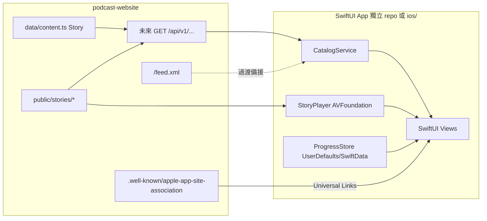

# iOS App 架構研究（SwiftUI）

> **狀態：** P0 架構 ✅ · P1 JSON API ✅ · **P2 SwiftUI 骨架 ✅**（[`ios/`](../ios/README.md)）  
> **決策：** 技術路線 = **原生 SwiftUI**（monorepo `ios/`；可之後拆獨立 repo）  
> **日期：** 2026-07-29  
> **Canonical 網站：** `https://podcast-website-mu.vercel.app`（見 [`lib/site-url.ts`](../lib/site-url.ts)）

## 1. 為什麼現在寫這份文件

官網「看圖聽故事」是差異化體驗；成長主戰場仍是 Spotify／Apple 收聽與短內容導流（見 [`TODOS.md`](../TODOS.md) 開頭共識）。若要做**第一方 iOS App**，必須先釐清：

1. 現有程式庫**能給原生客戶端什麼**、缺什麼。
2. App 與官網／平台 Podcast 的**產品邊界**（避免與平台搶完整收聽、又重複造輪）。
3. 後續實作時的**建議切片**（網站 JSON API → SwiftUI 客戶端 → Universal Links）。

本文件是後續 `/agent-plan` 或實作 ticket 的輸入，**不**改 Apple sync workflow、不新增 Route Handler、不開 Xcode 專案。

## 2. 決策紀錄

| 項 | 選擇 | 備註 |
|----|------|------|
| 技術 | **A — 原生 SwiftUI** | 獨立 Xcode 專案；本站日後補 JSON API／App Links |
| 本輪交付 | **C — 僅研究／架構文件** | 無 App Store 建置、無 API code |
| 不選 | WKWebView／Capacitor 包站、純 PWA 上架 | 可作備案，但非本次方向 |

## 3. 現況盤點（本 repo）

### 3.1 產品與技術

| 層 | 現況 |
|----|------|
| 產品 | Bonbon & 馬米《車車遊樂園》親子 podcast 官網：音檔 + 黏土風翻頁插圖 + 字幕 + 宇宙地圖 + 小遊戲 |
| 棧 | Next.js App Router、TypeScript strict、CSS Modules、SSG 為主、Vercel |
| 內容 | **靜態 repo 真相**：[`data/content.ts`](../data/content.ts) 的 `Story` + [`public/stories/<slug>/`](../public/stories/) |
| 同步 | Apple／SoundOn RSS → [`scripts/sync-apple-podcast.ts`](../scripts/sync-apple-podcast.ts)（**營運紅線，非 App 任務勿改**） |

### 3.2 原生客戶端今天就能用的 HTTP 面

| 資源 | URL 模式 | 用途 |
|------|----------|------|
| Podcast RSS | `{site}/feed.xml` | 集目、enclosure MP3、封面、duration、可選 `podcast:transcript` |
| 音檔／封面 | `{site}/stories/{slug}/audio.mp3`、`01.jpg`…`NN.jpg` | 靜態資產（可選 `NEXT_PUBLIC_AUDIO_BASE_URL` 轉 CDN） |
| 完整逐字稿 | `{site}/story/{slug}/transcript.vtt` | WebVTT（**不是**翻頁場景字幕） |
| 訂閱／許願 | `/api/subscribe`、`/api/zone-wish` | Email／地圖許願，**非**集目 API |

**沒有（P0 時）：** 公開 JSON 集目 API、OpenAPI、Universal Links（`apple-app-site-association`）、自訂 URL scheme、帳號系統。

**P1 已補：** `GET /api/v1/stories`、`GET /api/v1/stories/[slug]`、`GET /api/v1/meta`（見 §6）。仍無 OpenAPI／Universal Links／帳號。

### 3.3 網站有、但未對外暴露的能力（App 差異化候選）

| 能力 | 資料／程式錨點 | RSS 是否足夠 |
|------|----------------|--------------|
| 翻頁場景字幕 | `Story.captions` / `captionTimes` | **否**（見 [`docs/GEO-CONTENT-CONTRACT.md`](./GEO-CONTENT-CONTRACT.md)） |
| 完播反思 | `reflectionPrompt` | **否**（刻意不進 RSS） |
| 地圖 zone | `zoneId`、[`data/universe.ts`](../data/universe.ts) | 僅 show notes 深連結文字 |
| 角色／著色／遊戲 | `characters`、`coloring`、GameKit | **否** |
| 繼續聽／收藏 | [`lib/progress-store.ts`](../lib/progress-store.ts) `localStorage` | **否**（裝置本機） |

### 3.4 授權與法務邊界

- 程式碼 MIT；**`public/stories/`、`public/characters/` 音訊與插圖禁止再散布**（見 README／legal）。
- 第一方 App 若內嵌同一批媒體，須走**官方授權／發行路徑**（App Store 內播放 ≠ 開放再散布），實作前需產品／法務對齊，並同步 [`/legal`](../app/legal/page.tsx) 與 [`docs/FOR-PARENTS-DATA.md`](./FOR-PARENTS-DATA.md)。
- 兒童向 App：注意 App Store **Kids Category**、隱私營養標籤、追蹤限制；現站 analytics 為輕量事件、無登入。

## 4. 建議產品定位（相對官網與平台）

```text
Apple / Spotify          官網（現有）              第一方 iOS App（建議）
─────────────────        ─────────────────        ─────────────────────
完整音檔收聽主戰場        SEO／分享落地頁           「看圖聽故事」原生體驗
訂閱與發現                訂閱轉換中心              離線／背景播放＋本機進度
                          地圖／遊戲／PWA           可選：地圖瀏覽（遊戲後置）
```

**建議 MVP 產品句：** 給已認識品牌的親子，在 iPhone 上**離線也能看圖聽故事**（翻頁插圖 + 音檔 + 字幕），進度存在本機；完整發現與 SEO 仍靠官網與 Apple／Spotify。

**明確不做（第一版）：** 會員付費牆、跨裝置雲端同步、移植 Godot／GameKit 遊戲、取代 Apple Podcasts 訂閱。

## 5. 目標架構



| 元件 | 建議 |
|------|------|
| **iOS 專案** | monorepo [`ios/`](../ios/README.md)（SwiftUI + AVFoundation；iOS 17+）；可之後拆獨立 repo |
| **目錄來源** | **已上線：** 本站 **JSON API**（[`lib/api-v1.ts`](../lib/api-v1.ts)）；RSS `/feed.xml` 仍為 podcast 目錄／備援 |
| **媒體** | HTTPS 串流或下載快取；URL 與網站 `storyCoverPath`／`storyAudioUrl` 對齊 |
| **進度** | App 內 `UserDefaults`／SwiftData，欄位對齊網站 `favorites` + `continue`（見 §7）；**不**假設與 PWA `cheche:progress` 互通 |
| **深連結** | Universal Links：`/story/{slug}`、`/story/{slug}/play`、可選 `/adventures?zone=` |

## 6. JSON API 契約（P1 已實作）

> 實作：[`lib/api-v1.ts`](../lib/api-v1.ts)；路由：`app/api/v1/stories`、`app/api/v1/stories/[slug]`、`app/api/v1/meta`。  
> 原則：薄包裝 `data/content.ts` + 靜態路徑；**不**把 GameKit／Neon 訂閱塞進 v1；版本前綴 `/api/v1`；`Cache-Control: public, max-age=3600, s-maxage=3600`。

### 6.1 `GET /api/v1/stories`

回應：`{ "stories": StoryListItem[] }`（最新在前）。

```ts
type StoryListItem = {
  slug: string;
  ep: number;
  title: string;
  date: string; // YYYY-MM-DD
  duration?: string; // 與現站一致，如 "12:34"
  vehicle: string;
  summary?: string;
  tags?: string[];
  ageRange?: string;
  color: string;
  pageCount: number;
  coverUrl: string; // 絕對 URL
  audioUrl: string;
  zoneId?: "car-park" | "dino" | "rescue" | "ocean" | "forest";
  hasTranscriptVtt: boolean;
};
```

實作錨點：`listStoriesApi()` ← `storiesByNewest()`、`storyCoverPath`、`storyAudioUrl`、`hasTranscriptVtt`。

### 6.2 `GET /api/v1/stories/{slug}`

列表欄位 + 播放器所需（頂層物件，非包在 `story` 鍵下）：

```ts
type StoryDetail = StoryListItem & {
  captions?: string[];
  captionTimes?: number[]; // 秒
  pageImageUrls: string[]; // 長度 = pageCount
  transcriptVttUrl?: string;
  reflectionPrompt?: { child: string; parentFollowUp: string };
  characterIds?: string[];
};
```

**刻意省略 v1：** `familyActivity`／`parentGuide`／`episodeFaq`（家長網頁為主通路；App 需要時再加 `?include=parents`）。

未知 slug → `404` `{ "error": "not_found" }`。

### 6.3 `GET /api/v1/meta`

頻道常數（對齊 [`lib/feed-constants.ts`](../lib/feed-constants.ts)、[`lib/platforms.ts`](../lib/platforms.ts)）：

```ts
type ChannelMeta = {
  title: string;
  siteUrl: string;
  feedUrl: string;
  artworkUrl: string;
  platforms: { label: string; url: string }[];
};
```

### 6.4 錯誤與相容

- 未知 slug → `404` `{ "error": "not_found" }`
- 欄位新增採**加欄相容**；破壞性變更升 `/api/v2`
- RSS 與 JSON **並存**；RSS 維持 podcast 目錄義務，JSON 服務第一方客戶端

### 6.5 過渡策略

Swift 原型可直接打 JSON API；`/feed.xml` 僅作 podcast／備援，不必再 HEAD 探測翻頁圖。

## 7. SwiftUI 模組草圖（獨立專案）

| 模組 | 職責 |
|------|------|
| `App` | 場景、深連結、主題（對齊 [`DESIGN.md`](../DESIGN.md) 兒童向，非系統預設字體堆疊即可） |
| `Catalog` | 拉 `/api/v1/stories`、快取、搜尋（可移植 [`lib/story-query.ts`](../lib/story-query.ts) 邏輯） |
| `Player` | `AVPlayer`；翻頁與 `captionTimes` 同步；±10 秒；睡前定時（對齊網頁 `StoryPlayer` 行為） |
| `Subtitles` | 場景字幕 UI；可選載入 VTT 做完整逐字稿檢視 |
| `Progress` | `favorites: [slug]`、`continue: { slug, page, time, updatedAt }` |
| `Offline` | 下載音檔 + 頁圖；遵守儲存與 Kids 政策 |
| `Linking` | Universal Links → 開詳情／播放 |

**對齊網頁播放器行為（驗收參考）：** [`components/StoryPlayer.tsx`](../components/StoryPlayer.tsx) — 翻頁、字幕字級、繼續位置、完播反思。

## 8. Universal Links 與網站路徑對照

| Web | App 行為 |
|-----|----------|
| `/story/{slug}` | 開啟集詳情 |
| `/story/{slug}/play` | 開啟播放器（尊重 `?autoplay=` 僅在使用者手勢後） |
| `/stories` | 集目列表 |
| `/adventures?zone=` | 後續地圖版；MVP 可開 Safari 或略過 |
| `/feed.xml` | 不上 App UI |

網站側未來需：`public/.well-known/apple-app-site-association` + Apple Developer Associated Domains。**本輪不實作。**

## 9. 建議實作切片（文件之後）

順序固定，避免半套付費牆或動到 sync 紅線：

| 階段 | 範圍 | 主要異動面 |
|------|------|------------|
| **P0** | 本文件 + 產品／法務確認媒體進 App | `docs/` ✅ |
| **P1** | 網站 `GET /api/v1/stories` (+ `{slug}`、`meta`) + 契約測試 | `lib/api-v1.ts`、`app/api/v1/**`、vitest ✅ |
| **P2** | SwiftUI 骨架：列表 → 詳情 → 播放（串流） | [`ios/`](../ios/README.md) ✅ |
| **P3** | 本機進度、收藏、繼續聽、基本離線 | iOS |
| **P4** | Universal Links + 官網 CTA「用 App 看圖聽」 | 網站 AASA + 文案 |
| **P5** | 場景字幕／反思／地圖唯讀（可選） | API 加欄 + iOS |
| **P6+** | 遊戲／帳號／商業化 | 對齊 STEM-P4，不提前做半套 |

**品質閘門（網站 P1）：** `npm test`、`npm run build`、`npx tsc --noEmit`；若動到 site-url／feed 相關，另跑 `npm test -- scripts/lib/sync-workflow-contract.test.ts`。

**紅線：** 不修改 `.github/workflows/sync-apple-podcast.yml`、`sync-watchdog.yml`、`scripts/sync-apple-podcast.ts`（除非任務本身是 sync）。

## 10. 風險與未決（實作前再用文字 A/B/C 決策）

| 風險 | 說明 |
|------|------|
| 與成長共識衝突 | App 可能分流「到官網訂閱平台」的轉換；需定義 App 內仍強導 Apple／Spotify |
| 媒體授權 | 插圖／音檔進 App Store 二進位或快取的法律路徑 |
| Kids Category | 限制追蹤、外連、IAP 規則 |
| 雙端進度 | Web PWA 與 App 進度不互通，需在 UX 上說清楚 |
| `pageCount`／插畫未齊集 | Apple 同步集可能 `pageCount: 1`；App 應降級為「純音檔 + 單封面」 |

## 11. 相關檔案索引

| 主題 | 路徑 |
|------|------|
| `Story` 型別 | [`data/content.ts`](../data/content.ts) |
| RSS | [`app/feed.xml/route.ts`](../app/feed.xml/route.ts)、[`lib/feed.ts`](../lib/feed.ts) |
| 音檔／封面路徑 | [`lib/story-utils.ts`](../lib/story-utils.ts) |
| 場景 vs 完整逐字稿 | [`docs/GEO-CONTENT-CONTRACT.md`](./GEO-CONTENT-CONTRACT.md) |
| 本機進度 | [`lib/progress-store.ts`](../lib/progress-store.ts) |
| 播放器 UX | [`components/StoryPlayer.tsx`](../components/StoryPlayer.tsx) |
| 設計系統 | [`DESIGN.md`](../DESIGN.md) |
| 家長資料說明 | [`docs/FOR-PARENTS-DATA.md`](./FOR-PARENTS-DATA.md) |
| 平台連結 | [`lib/platforms.ts`](../lib/platforms.ts) |

## 12. 交付清單

- [x] 現況盤點與可消費面（P0）
- [x] SwiftUI + JSON API 目標架構（P0）
- [x] `/api/v1` 契約草案（P0）→ **已實作（P1）**
- [x] 分階段切片與紅線
- [x] P1 程式：`lib/api-v1.ts` + Route Handlers + vitest
- [x] P2 SwiftUI：`ios/CheCheCar` 列表／詳情／AVPlayer（需 Mac 開 Xcode）
- [ ] 本機進度／離線（P3）
- [ ] Universal Links／AASA（P4）
